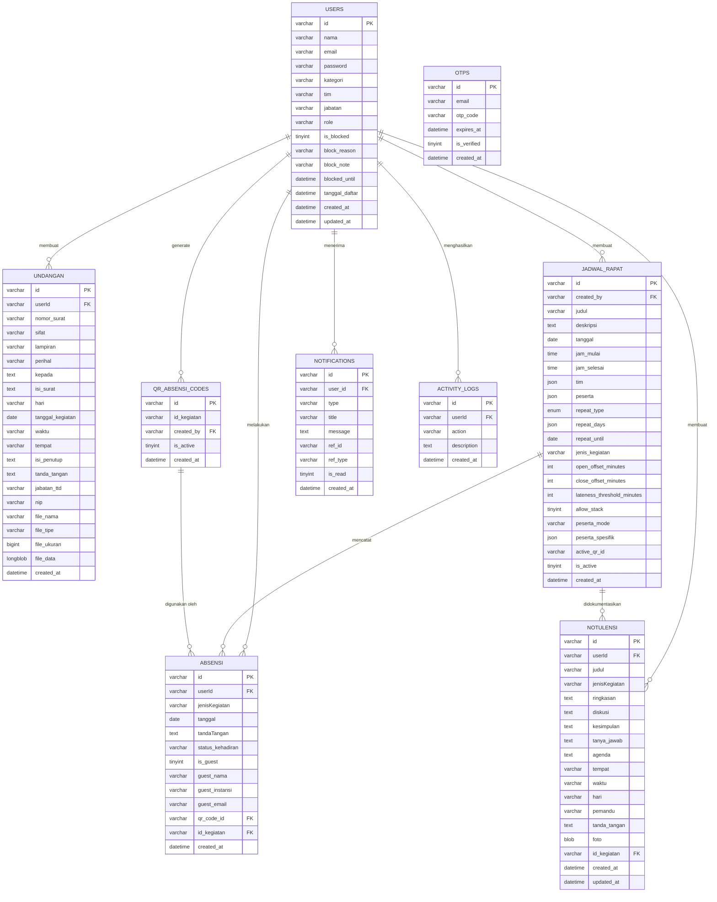
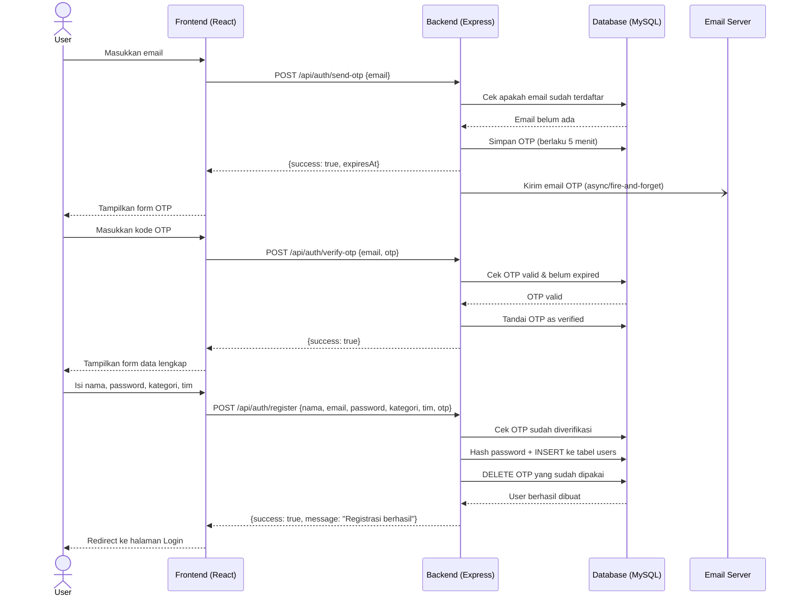
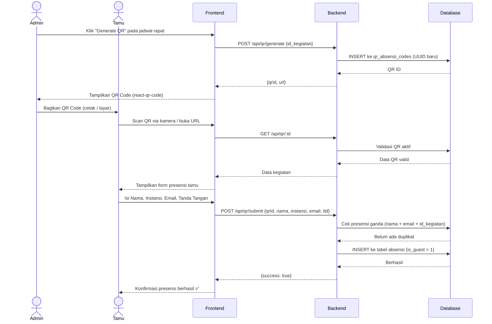
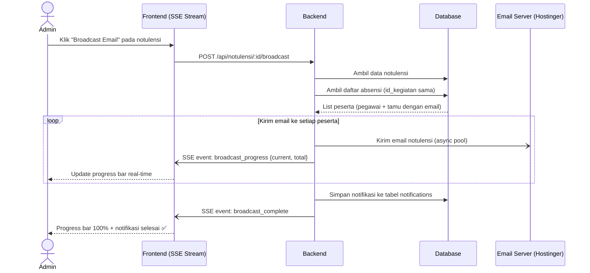
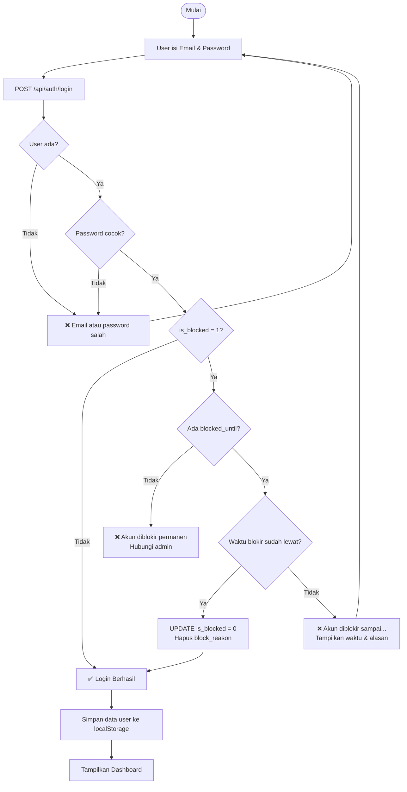
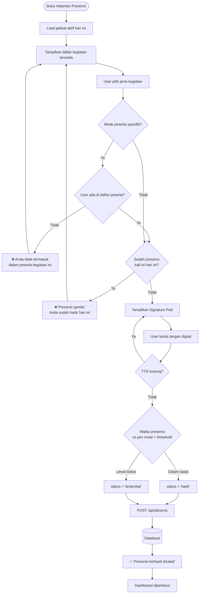
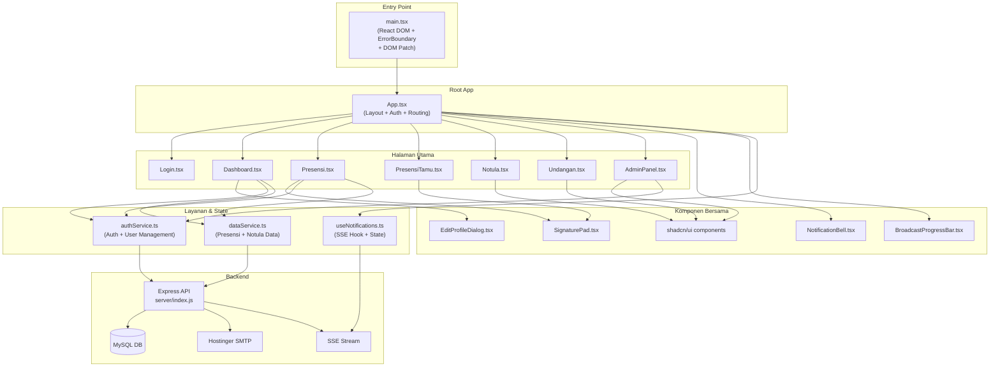
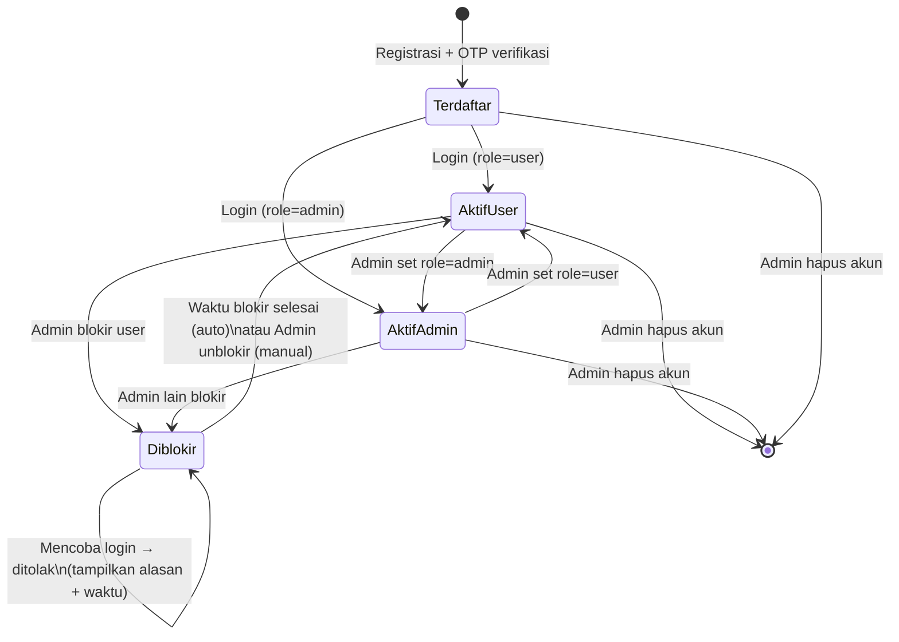

# Diagram Sistem Syntak

Dokumentasi visual arsitektur dan alur sistem **Syntak** — Sistem Presensi, Notulensi, Undangan, dan Jadwal Rapat BPS Kota Surabaya.

---

## 1. Use Case Diagram

```mermaid
graph TD
    subgraph Actors["👤 Aktor"]
        A[Admin]
        P[Pegawai / Magang]
        T[Tamu]
    end

    subgraph UC_AUTH["🔐 Autentikasi"]
        UC1([Registrasi dengan OTP])
        UC2([Login])
        UC3([Edit Profil])
        UC4([Logout])
    end

    subgraph UC_DASH["📊 Dashboard"]
        UC5([Lihat Statistik Presensi])
        UC6([Lihat Grafik Kehadiran])
        UC7([Refresh Data Dashboard])
    end

    subgraph UC_ABS["✅ Presensi"]
        UC8([Isi Presensi Kegiatan])
        UC9([Tanda Tangan Digital])
        UC10([Lihat Riwayat Presensi])
        UC11([Export Laporan PDF])
        UC12([Buat QR Code Presensi])
        UC13([Isi Presensi via QR])
    end

    subgraph UC_NOT["📝 Notulensi"]
        UC14([Buat Notulensi])
        UC15([Edit / Hapus Notulensi])
        UC16([Broadcast Email Notulensi])
    end

    subgraph UC_UND["✉️ Undangan"]
        UC17([Buat Surat Undangan])
        UC18([Edit / Hapus Undangan])
        UC19([Upload File Undangan])
    end

    subgraph UC_JAD["📅 Jadwal Rapat"]
        UC20([Lihat Jadwal Rapat])
        UC21([Buat Jadwal Rapat])
        UC22([Atur Jadwal Berulang])
        UC23([Hapus Jadwal])
    end

    subgraph UC_ADM["🛡️ Panel Admin"]
        UC24([Kelola User])
        UC25([Blokir / Unblokir User])
        UC26([Lihat Log Aktivitas])
        UC27([Hapus Log Aktivitas])
        UC28([Set Role Admin])
    end

    %% Admin use cases
    A --> UC1
    A --> UC2
    A --> UC3
    A --> UC4
    A --> UC5
    A --> UC6
    A --> UC7
    A --> UC10
    A --> UC11
    A --> UC12
    A --> UC14
    A --> UC15
    A --> UC16
    A --> UC17
    A --> UC18
    A --> UC19
    A --> UC20
    A --> UC21
    A --> UC22
    A --> UC23
    A --> UC24
    A --> UC25
    A --> UC26
    A --> UC27
    A --> UC28

    %% Pegawai/Magang use cases
    P --> UC1
    P --> UC2
    P --> UC3
    P --> UC4
    P --> UC5
    P --> UC6
    P --> UC7
    P --> UC8
    P --> UC9
    P --> UC10
    P --> UC14
    P --> UC15
    P --> UC17
    P --> UC18
    P --> UC19
    P --> UC20

    %% UC8 includes UC9
    UC8 -->|"includes"| UC9

    %% Tamu use cases
    T --> UC13
    T --> UC9
```

---

## 2. Entity Relationship Diagram (ERD)

---

## 3. Sequence Diagram — Alur Registrasi dengan OTP

---

## 4. Sequence Diagram — Presensi via QR Code (Tamu)

---

## 5. Sequence Diagram — Broadcast Email Notulensi

---

## 6. Flowchart — Alur Login & Validasi Blokir

---

## 7. Flowchart — Alur Pengisian Presensi Pegawai

---

## 8. Arsitektur Komponen Frontend

---

## 9. State Machine — Siklus Hidup Akun User

---

_Dokumen diagram ini dibuat otomatis berdasarkan analisis source code proyek Syntak._  
_Semua diagram menggunakan format Mermaid dan dapat dirender di GitHub, VSCode, atau Mermaid Live Editor._
