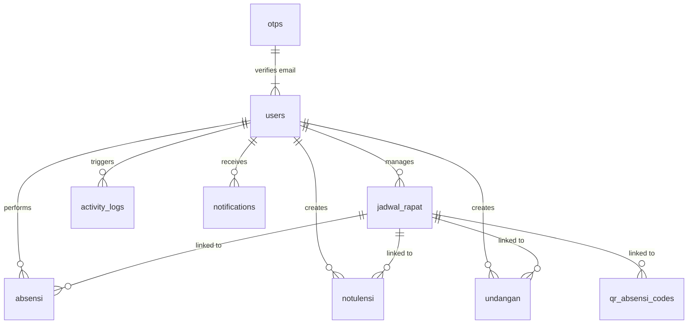

# Database Schema - Syntak

This document describes the MySQL database schema for the Syntak system (`absensi_notulensi`).

## Entity Relationship Diagram

## Tables

### users
Stores user accounts and profiles.

| Field | Type | Null | Key | Default | Notes |
|-------|------|------|-----|---------|-------|
| id | varchar(36) | NO | PRI | null | UUID |
| nama | varchar(255) | NO | | null | Full name |
| email | varchar(255) | NO | UNI | null | Login email |
| password | varchar(255) | NO | | null | Hashed with bcrypt |
| kategori | enum('Pegawai','Magang') | NO | | null | User category |
| tim | varchar(255) | YES | | null | Team/Unit |
| jabatan | varchar(255) | YES | | null | Job title |
| role | enum('user','admin','tamu') | YES | MUL | user | Access level |
| tanggal_daftar| datetime | YES | | current_timestamp | Registration date |
| is_blocked | tinyint(1) | YES | MUL | 0 | Block status |
| block_reason | enum('izin','sakit','alpa','izin-telat') | YES | | null | Reason for block |
| block_note | text | YES | | null | Custom note for block |
| blocked_until | datetime | YES | | null | Expiry for block |

### absensi
Stores presence records.

| Field | Type | Null | Key | Default | Notes |
|-------|------|------|-----|---------|-------|
| id | varchar(36) | NO | PRI | null | UUID |
| user_id | varchar(36) | YES | MUL | null | Link to users.id |
| nama_user | varchar(255) | NO | | null | Name at time of attendance |
| jenis_kegiatan| enum(...) | NO | MUL | null | Category of activity |
| nama_kegiatan | varchar(255) | YES | | null | Specific name |
| id_kegiatan | varchar(36) | YES | MUL | null | Link to jadwal_rapat.id |
| tanggal | date | NO | MUL | null | Date |
| waktu | time | NO | | null | Time of check-in |
| signature | text | NO | | null | Base64 signature image |
| status | enum('hadir','tidak-hadir') | YES | | hadir | Presence status |
| is_guest | tinyint(1) | YES | MUL | 0 | Flag for guest users |
| status_kehadiran| enum('hadir','terlambat') | YES | | hadir | Lateness status |

### jadwal_rapat
Manages meeting schedules and activity scheduling.

| Field | Type | Null | Key | Default | Notes |
|-------|------|------|-----|---------|-------|
| id | varchar(36) | NO | PRI | null | UUID |
| judul | varchar(255) | NO | | null | Title of meeting |
| tanggal | date | NO | MUL | null | Date |
| jam_mulai | time | NO | | null | Start time |
| jam_selesai | time | NO | | null | End time |
| tim | longtext | NO | | null | Targeted teams (JSON array) |
| peserta | longtext | NO | | null | Targeted categories (JSON array) |
| repeat_type | enum(...) | YES | | none | Recurrence pattern |
| open_offset_minutes | int | YES | | 0 | Buffer before start to open check-in |
| close_offset_minutes| int | YES | | 0 | Buffer after end to close check-in |
| lateness_threshold_minutes | int | YES | | 60 | Grace period before marked late |
| created_by | varchar(36) | NO | MUL | null | Link to users.id |
| is_active | tinyint(1) | YES | MUL | 1 | Soft delete / toggle |
| peserta_mode | varchar(30) | YES | | akun | `akun` or `spesifik` |
| peserta_spesifik | longtext | YES | | null | Specific user IDs (JSON array) |
| active_qr_id | varchar(36) | YES | | null | ID of active QR code |

### notulensi
Meeting minutes storage.

| Field | Type | Null | Key | Default | Notes |
|-------|------|------|-----|---------|-------|
| id | varchar(36) | NO | PRI | null | UUID |
| user_id | varchar(36) | NO | MUL | null | Link to users.id (creator) |
| judul | varchar(500) | NO | | null | Title |
| id_kegiatan | varchar(36) | YES | MUL | null | Link to jadwal_rapat.id |
| ringkasan | text | YES | | null | Brief overview |
| diskusi | text | YES | | null | Discussion points |
| kesimpulan | text | YES | | null | Conclusions |
| tanya_jawab | text | YES | | null | Q&A records |
| isi | text | NO | | null | Full content |
| foto | text | YES | | null | Base64 strings (JSON array) |
| signature | text | YES | | null | Base64 signature image |

### undangan
Invitation card data.

| Field | Type | Null | Key | Default | Notes |
|-------|------|------|-----|---------|-------|
| id | varchar(36) | NO | PRI | null | UUID |
| user_id | varchar(36) | NO | MUL | null | Link to users.id |
| id_kegiatan | varchar(36) | YES | MUL | null | Link to jadwal_rapat.id |
| perihal | text | NO | | null | Subject |
| nomor_surat | varchar(255) | NO | | null | External ref number |
| is_uploaded_file| tinyint(1) | YES | | 0 | Flag for PDF upload |
| uploaded_file_data | longtext | YES | | null | Base64 file data |

### qr_absensi_codes
Active QR codes for attendance.

| Field | Type | Null | Key | Default | Notes |
|-------|------|------|-----|---------|-------|
| id | varchar(36) | NO | PRI | null | UUID |
| id_kegiatan | varchar(36) | YES | | null | Link to jadwal_rapat.id |
| created_by | varchar(36) | NO | MUL | null | Link to users.id |
| expires_at | datetime | YES | | null | Expiry time |
| is_active | tinyint(1) | YES | MUL | 1 | Scan status |

### notifications
In-app notifications for users.

| Field | Type | Null | Key | Default | Notes |
|-------|------|------|-----|---------|-------|
| id | varchar(36) | NO | PRI | null | UUID |
| user_id | varchar(36) | NO | MUL | null | Link to users.id |
| type | varchar(50) | NO | | info | notif type |
| title | varchar(255) | NO | | null | Heading |
| is_read | tinyint(1) | YES | MUL | 0 | Read flag |

### activity_logs
Security and audit logs.

| Field | Type | Null | Key | Default | Notes |
|-------|------|------|-----|---------|-------|
| id | varchar(36) | NO | PRI | null | UUID |
| user_id | varchar(36) | NO | MUL | null | Link to users.id |
| aktivitas | text | NO | | null | Action description |
| tanggal | date | NO | MUL | null | Date |
| waktu | time | NO | | null | Time |

### otps
Email verification codes.

| Field | Type | Null | Key | Default | Notes |
|-------|------|------|-----|---------|-------|
| id | varchar(36) | NO | PRI | null | UUID |
| email | varchar(255) | NO | MUL | null | Target email |
| otp_code | varchar(6) | NO | | null | Numeric code |
| expires_at | datetime | NO | MUL | null | TTL |
| is_verified | tinyint(1) | YES | | 0 | Verification status |
